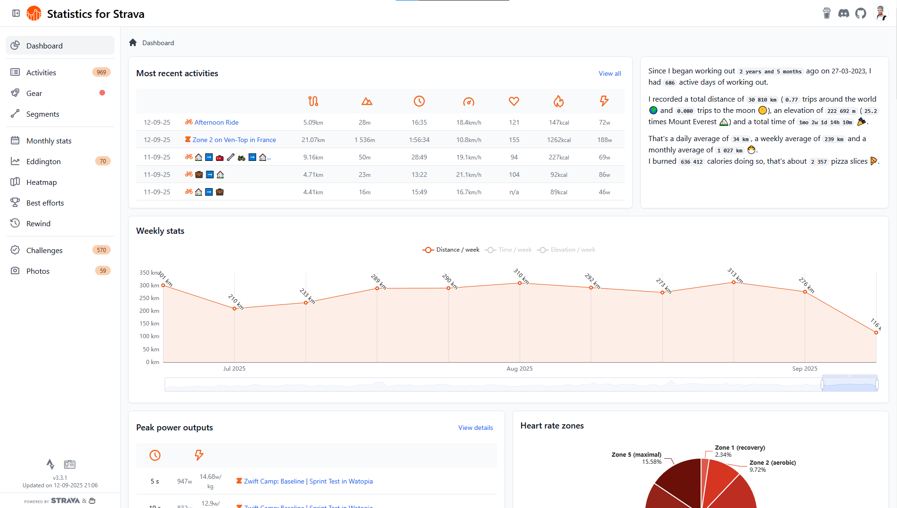

# Statistics for Strava (Community)

## What it is
Statistics for Strava is a self-hosted, open-source dashboard for your Strava data.

## How to access
After install, TrueNAS assigns a host port automatically. Use the app link in **Apps → Installed** (or visit `http://<TrueNAS-IP>:<assigned-port>`).
*(The app listens on port 3000 in-container; TrueNAS chooses the host port.)*

## Obtaining a Strava refresh token
- Do not use the refresh token displayed on your Strava API settings page, it will not work. 

The first time you launch the app, you will need to obtain a Strava refresh token. The app needs this token to be able to access your data and import it into your local database.

Navigate to http://localhost:8080/. You should see this page—just follow the steps to complete the setup.

## Import and build statistics
Once you have successfully authenticated with Strava, you can import your data and build the html files, after which you can view your statistics.

- Everytime you import data, you need to rebuild the HTML files to see the changes. 

## Importing Challenges and trophies
### New challenges
Only visible challenges on your public profile can be imported. Please make sure that your profile is public, otherwise the app won't be able to import them.
### Complete History
Strava does not allow to fetch a complete history of your completed challenges and trophies. There's a little workaround if you'd still like to import these:
- Navigate to https://www.strava.com/athletes/[YOUR_ATHLETE_ID]/trophy-case
- Open the page's source code and copy everything
- Make sure you save the source code to the file ./storage/files/strava-challenge-history.html
- On the next import, all your challenges will be imported
#### WARNING
Make sure before you save the source code, your Strava account is set to be translated in English. The app can only handle this export in English for now. 

